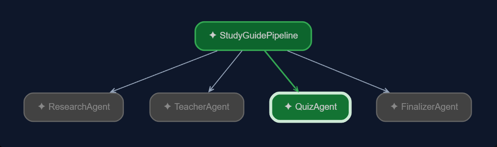

# Sequential Agent — Study Guide Pipeline

This project demonstrates how to build a **sequential multi-agent workflow** using the Google Agent Development Kit (ADK).

The pipeline takes a technical topic from the user and passes it through a series of specialized agents. Each agent completes one stage and passes its output to the next agent.

## Workflow



The pipeline follows this sequence:

```text
User Topic
    ↓
ResearchAgent
    ↓
TeacherAgent
    ↓
QuizAgent
    ↓
FinalizerAgent
    ↓
Final Study Guide
```

## What This Project Demonstrates

- Creating a `SequentialAgent`
- Splitting a complex task into specialized agents
- Executing agents in a fixed order
- Passing information between agents using `output_key`
- Using session state to make previous agent output available to later agents
- Building a practical multi-agent pipeline with Google ADK

## Project Structure

```text
10_sequential_agent/
│
├── sequential_agent/
│   ├── __init__.py
│   ├── agent.py
│   │
│   └── sub_agent/
│       ├── __init__.py
│       ├── research_agent.py
│       ├── teacher_agent.py
│       ├── quiz_agent.py
│       └── finalizer_agent.py
│
├── README.md
└── sequential-agent-workflow.png
```

## Agents

### 1. ResearchAgent

The first agent researches the requested topic and produces a structured technical report.

**Responsibility:**

```text
Topic → Technical Research
```

Its output is stored using an `output_key`, allowing the next agent to access it.

---

### 2. TeacherAgent

The second agent takes the research output and converts it into a beginner-friendly explanation.

**Responsibility:**

```text
Research → Explanation
```

This stage focuses on simplifying concepts, terminology, examples, and practical understanding.

---

### 3. QuizAgent

The third agent uses the previous outputs to create questions for testing the learner's understanding.

**Responsibility:**

```text
Explanation → Quiz
```

This makes the pipeline more useful than simply generating an explanation: the learner also gets a way to test their knowledge.

---

### 4. FinalizerAgent

The final agent combines the generated information into a structured study guide.

**Responsibility:**

```text
Research + Explanation + Quiz → Final Study Guide
```

The final result is designed to provide the user with one complete learning resource.

## Data Flow

Each agent produces an output that can be referenced by the following agent through ADK state.

Conceptually:

```text
ResearchAgent
    │
    │ output_key = "research"
    ↓
TeacherAgent
    │
    │ output_key = "explanation"
    ↓
QuizAgent
    │
    │ output_key = "quiz"
    ↓
FinalizerAgent
```

This demonstrates an important multi-agent pattern:

> **One agent's output becomes another agent's input.**

## Example

Input:

```text
Explain JavaScript closures
```

The pipeline processes the request:

```text
Explain JavaScript closures
        ↓
ResearchAgent
        ↓
Technical research about closures
        ↓
TeacherAgent
        ↓
Beginner-friendly explanation
        ↓
QuizAgent
        ↓
Questions to test understanding
        ↓
FinalizerAgent
        ↓
Complete study guide
```

## Running the Project

Make sure your virtual environment is activated and Google ADK is installed.

From inside the `10_sequential_agent` directory:

```bash
adk run sequential_agent
```

For the ADK web interface:

```bash
adk web
```

Then select the `sequential_agent` application in the ADK Web UI.

## Example Prompt

Try:

```text
Explain JavaScript closures
```

Other useful test prompts:

```text
Explain REST APIs
```

```text
Explain React useEffect
```

```text
Explain JavaScript promises
```

```text
Explain PostgreSQL indexes
```

## Why Sequential Agents?

A sequential pipeline is useful when a task naturally follows a fixed series of steps.

For example:

```text
Research
   ↓
Teach
   ↓
Test
   ↓
Finalize
```

Each stage depends on the previous stage, making sequential orchestration a natural fit.

## Key Learning

The main concept demonstrated by this project is **workflow decomposition**.

Instead of asking one agent to perform every task:

```text
One Large Agent
    ↓
Research + Teaching + Quiz + Formatting
```

we divide the responsibility:

```text
ResearchAgent
      ↓
TeacherAgent
      ↓
QuizAgent
      ↓
FinalizerAgent
```

This makes each agent's responsibility clear and demonstrates how multiple specialized agents can cooperate to solve a larger problem.

## ADK Note

This project uses `SequentialAgent` because it is the sequential orchestration API available in the project's current Google ADK environment.

In newer ADK versions, Google is moving toward graph-based `Workflow` orchestration. The exact API available can depend on the installed ADK version.

## Part of the ADK Journey

This project is part of the **ADK from Zero — Build Agentic AI with Google ADK** repository.

The broader progression is:

```text
LLM
 ↓
Agent
 ↓
Tools
 ↓
State
 ↓
Memory
 ↓
Multi-Agent Systems
 ↓
Workflows
 ↓
Real-World Agentic Applications
```

---

**Built as a practical example for learning and experimenting with Google ADK.**
